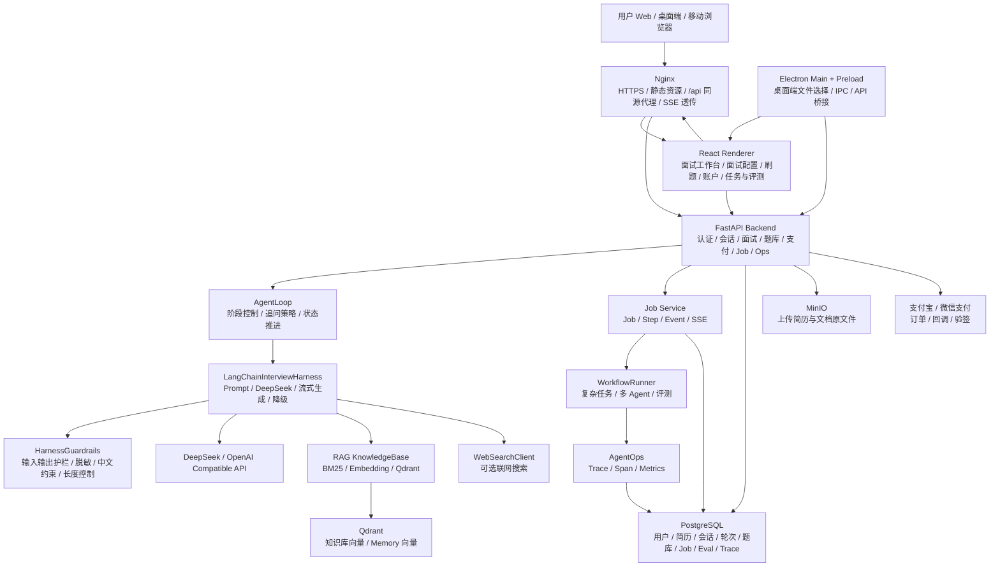
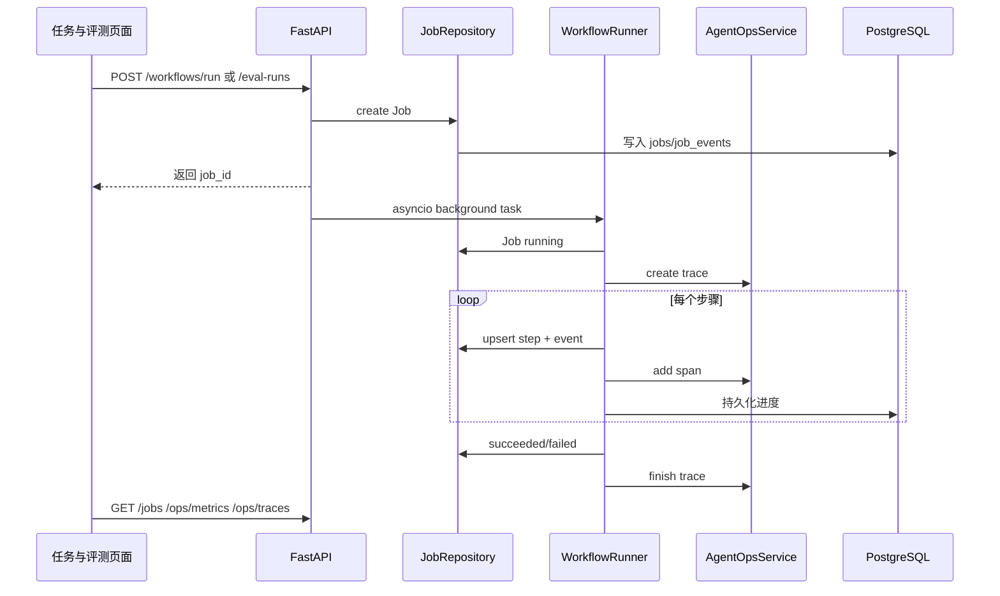
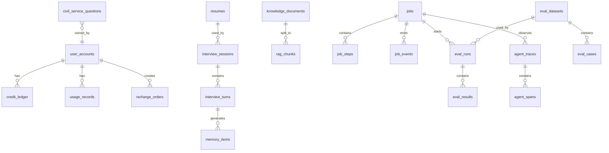
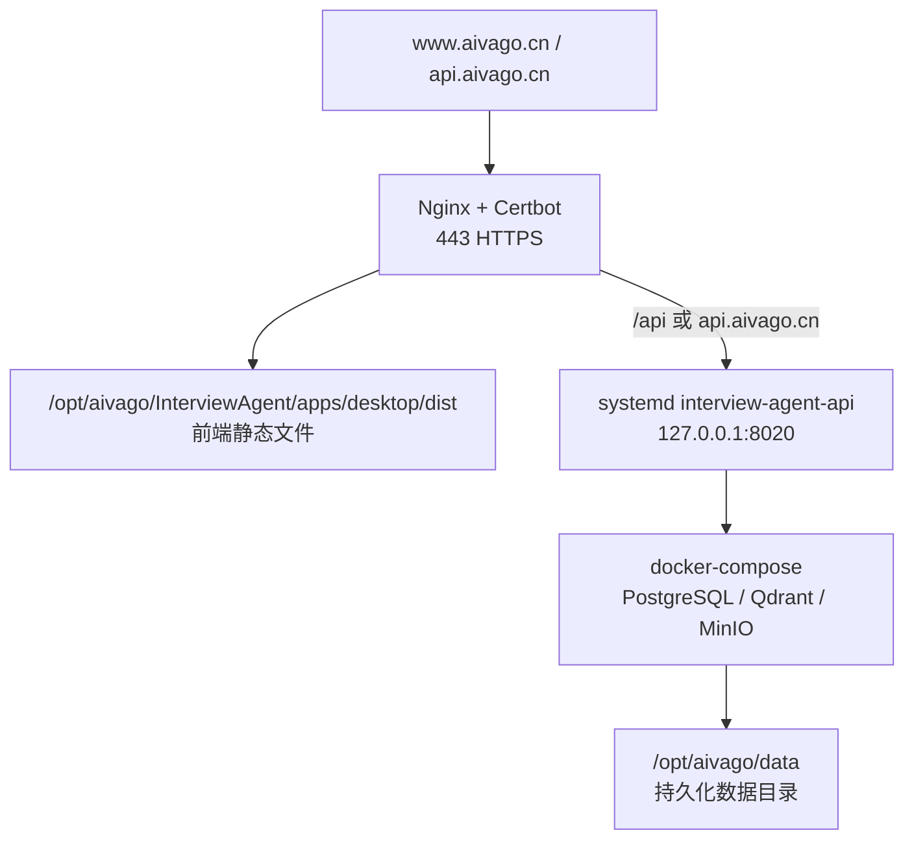

# Interview Agent 架构图与项目解析

这份文档用于面试讲解。它按“项目定位 -> 总体架构 -> 核心链路 -> 技术亮点 -> 可追问回答”的顺序组织，适合快速复盘和现场表达。

## 1. 项目一句话

Interview Agent 是一个面向 AI 技术面试和刷题训练的 Agent 工作台。它支持简历驱动面试、候选人答题模拟、题库练习、SSE 流式对话、RAG 检索增强、账户计费、支付充值、长任务执行、质量评估和 AgentOps 观测。

面试中可以这样说：

> 我做的是一个生产化 AI 面试 Agent 平台，不只是一个聊天 Demo。它把 LLM 对话、RAG、简历解析、会话持久化、用户账户、计费、安全、运维观测、长任务和质量评估都整合到了同一个工程体系里。

## 2. 总体架构图



## 3. 分层架构

```mermaid
flowchart LR
  subgraph Client["客户端层"]
    React["React UI"]
    Desktop["Electron Main / Preload"]
  end

  subgraph Gateway["接入层"]
    Nginx["Nginx HTTPS\n同源 /api 代理\nSSE buffer 关闭"]
    Security["CORS / 安全响应头 / 限流 / Request ID"]
  end

  subgraph API["接口层"]
    FastAPI["FastAPI Routes"]
    Envelope["统一响应结构\ncode / message / data / request_id"]
    Errors["错误码\nApiErrorCode"]
  end

  subgraph Domain["业务层"]
    Interview["面试会话"]
    Practice["刷题题库"]
    Billing["账户计费"]
    Payment["支付充值"]
    Job["长任务"]
    Eval["质量评估"]
    Ops["AgentOps"]
  end

  subgraph AI["AI 编排层"]
    Loop["AgentLoop"]
    Harness["LangChain Harness"]
    RAG["RAG / Search"]
    Guardrails["Guardrails"]
  end

  subgraph Infra["基础设施层"]
    DB["SQLAlchemy + Alembic"]
    ObjectStorage["ObjectStorage"]
    Vector["VectorStore"]
    Settings["Settings / Env"]
  end

  Client --> Gateway --> API --> Domain --> AI --> Infra
```



## 4. 核心目录说明

```text
backend/src/interview_agent/
  interfaces/
    api.py                 FastAPI API 入口，统一响应、安全头、主要业务路由
    cli.py                 CLI 入口，支持 run/index/api/doctor/eval-rag
    error_codes.py         统一错误码
  core/
    agent_loop.py          面试状态机和追问控制
    harness.py             LLM 调用、Prompt、DeepSeek/OpenAI Compatible、流式生成
    guardrails.py          输入输出护栏
    state.py               面试状态和轮次模型
    config.py              面试配置
  rag/
    knowledge_base.py      Markdown 知识库和检索
    vector_store.py        Qdrant/本地向量存储抽象
    rag_index.py           RAG 索引构建
    rag_eval.py            RAG 回归评测
  services/
    interview_persistence_service.py  会话持久化
    resume_service.py                 简历保存和对象存储
    billing_service.py                账户、积分、用量扣费
    workflow_runner.py                长任务、工作流、多 Agent、评测执行器
    agent_ops_service.py              Trace/Span/Metrics
  repositories/
    interview_repository.py  面试会话读写
    resume_repository.py     简历读写
    civil_service_repository.py 题库读写
    job_repository.py        Job/Step/Event 读写
  infrastructure/
    db/models.py             SQLAlchemy 数据模型
    db/session.py            异步数据库连接
    security.py              鉴权、限流、上下文
    payments.py              支付宝/微信支付封装
    object_storage/          MinIO/本地对象存储

apps/desktop/src/
  main.js                    Electron 主进程，IPC 到 API
  preload.js                 安全暴露 window.interviewAgent
  renderer/
    App.jsx                  前端状态编排
    apiClient.js             Web 同源 /api 请求封装
    components/              账户、聊天、配置、刷题、任务与评测等 UI 组件

scripts/
  deploy_server.sh           服务端部署脚本
  configure_nginx_web.sh     Nginx Web/API/SSE 配置脚本
```

## 5. 面试对话链路

```mermaid
sequenceDiagram
  participant U as 用户
  participant FE as React/Electron
  participant API as FastAPI
  participant Billing as BillingService
  participant Loop as AgentLoop
  participant Harness as LangChainHarness
  participant RAG as RAG/Search
  participant LLM as DeepSeek
  participant DB as PostgreSQL

  U->>FE: 输入回答或问题
  FE->>API: POST /sessions/{id}/stream
  API->>API: 鉴权、限流、参数校验
  API->>Billing: ensure_can_use
  API->>Loop: step_stream(message)
  Loop->>Harness: 构造面试上下文
  Harness->>RAG: 检索知识库和历史记忆
  Harness->>LLM: 调用 DeepSeek 流式生成
  LLM-->>Harness: token delta
  Harness-->>API: message.delta
  API-->>FE: SSE message.delta
  Harness-->>Loop: 最终结果
  API->>Billing: 记录 token 和扣费
  API->>DB: 保存会话状态、轮次、记忆
  API-->>FE: SSE message.done
```

关键点：

- 前端优先使用 SSE 流式接口，实时显示模型输出。
- 如果流式连接失败，前端会降级到普通请求。
- 后端即使客户端断开，也会尽量把模型结果持久化，降低“DeepSeek 消耗 token 但页面没收到”的风险。
- 会话状态持久化到 PostgreSQL，刷新页面后可恢复历史会话。

## 6. 长任务与 AgentOps 链路



目前已经具备：

- 长任务模型：`JobModel`、`JobStepModel`、`JobEventModel`
- 任务事件流：`GET /jobs/{job_id}/events/stream`
- 工作流执行：`WorkflowRunner`
- 多 Agent 骨架：Planner、Researcher、Executor、Critic、Reporter
- 评测运行：`EvalRunModel`、`EvalResultModel`
- AgentOps：`AgentTraceModel`、`AgentSpanModel`、metrics summary

面试中可以这样说：

> 我没有一开始引入 Celery 这类重依赖，而是先把任务抽象、状态机、事件流和可观测数据模型设计出来。当前用 asyncio background task 跑轻量任务，后续要扩展到队列 worker，只需要替换 runner 调度层，API 和前端都不用改。

## 7. 数据架构



核心数据表：

- 用户账户：`user_accounts`
- 积分流水：`credit_ledger`
- 用量记录：`usage_records`
- 充值订单：`recharge_orders`
- 简历：`resumes`
- 面试会话：`interview_sessions`
- 面试轮次：`interview_turns`
- 长期记忆：`memory_items`
- 知识库：`knowledge_documents`、`rag_chunks`
- 题库：`civil_service_questions`，现在已经泛化为 practice question
- 长任务：`jobs`、`job_steps`、`job_events`
- 评测：`eval_datasets`、`eval_cases`、`eval_runs`、`eval_results`
- AgentOps：`agent_traces`、`agent_spans`

## 8. 功能模块解析

### 8.1 面试 Agent

核心文件：

- `core/agent_loop.py`
- `core/harness.py`
- `core/state.py`
- `services/interview_persistence_service.py`
- `repositories/interview_repository.py`

实现思路：

1. `InterviewConfig` 描述候选人、岗位、模式、模型、思考模式等配置。
2. `InterviewState` 保存当前阶段、所有轮次、是否完成。
3. `AgentLoop` 控制面试推进，例如项目深挖、系统设计、RAG/Agent、评测上线、安全治理。
4. `LangChainInterviewHarness` 负责构造 prompt、注入 RAG 上下文、调用 DeepSeek。
5. 结果返回后通过 repository 同步到 PostgreSQL。

亮点：

- 不是简单 prompt，而是有状态机。
- 支持 `Agent 面试我` 和 `Agent 回答我` 两种模式。
- 支持 SSE token 级流式输出。
- 支持 Guardrails 和降级。
- 支持回答质量判断和追问策略。

### 8.2 RAG 和知识库

核心文件：

- `rag/knowledge_base.py`
- `rag/rag_index.py`
- `rag/vector_store.py`
- `embeddings/embedding_service.py`

实现思路：

1. Markdown 资料被切分为 chunk。
2. 支持 BM25 检索，也支持 embedding 向量检索。
3. 向量库可以使用 Qdrant。
4. 面试时根据候选人问题、目标岗位和上下文检索资料，注入 prompt。
5. 提供 `eval-rag` 做检索回归评测。

面试表达：

> RAG 这块我做了索引构建、检索抽象和回归评测，不是每次请求临时扫文件。生产环境推荐用 Qdrant 持久化向量，启动时根据 `.interview_agent/vector_store.json` 恢复向量后端。

### 8.3 简历解析和对象存储

核心文件：

- `infrastructure/resume_parser.py`
- `services/resume_service.py`
- `repositories/resume_repository.py`
- `infrastructure/object_storage/storage.py`

实现思路：

1. 前端上传 PDF/Markdown/Text。
2. 后端解析文本和摘要。
3. PostgreSQL 保存结构化元数据、摘要、正文和 hash。
4. MinIO 或本地对象存储保存原文件。
5. 用内容 hash 去重，避免重复保存。

亮点：

- 简历不是只放在浏览器 localStorage，而是生产式持久化。
- 支持多简历选择。
- 支持最大上传大小限制和路径隐私保护。

### 8.4 账户、计费和支付

核心文件：

- `services/billing_service.py`
- `domain/billing.py`
- `infrastructure/payments.py`
- `interfaces/api.py`

实现思路：

1. 邮箱注册、登录后发放 token。
2. 账户有试用次数和积分余额。
3. 每次模型调用记录 usage。
4. 根据模型价格和 token 估算消耗积分。
5. 支持支付宝、微信支付订单和 webhook 验签。

可讲亮点：

- token 用量和成本被业务化，不是无限制调用模型。
- 用 `idempotency_key` 防止重复扣费。
- 支付回调需要验签，不信任客户端充值结果。

### 8.5 刷题和学习

核心文件：

- `domain/civil_service.py`
- `repositories/civil_service_repository.py`
- `components/study/StudyCenter.jsx`
- `utils/questionBankParser.js`

实现思路：

1. 题库从“考公”扩展成通用 practice question。
2. 训练类型包含互联网、AI 工程、考公、通用面试。
3. 系统有默认题库，用户上传题库只是补充。
4. 支持 JSON/CSV 题库导入。

亮点：

- 面试和刷题是一体化能力，不是两个割裂产品。
- AI 工程题库覆盖 Agent Harness、AgentOps、RAG、搜索、多 Agent、复杂任务编排、异步工作流、长任务、质量评估。

### 8.6 长任务、评测和 AgentOps

核心文件：

- `services/workflow_runner.py`
- `services/agent_ops_service.py`
- `repositories/job_repository.py`
- `components/operations/OperationsCenter.jsx`

实现思路：

1. API 创建任务：`POST /jobs`、`POST /workflows/run`、`POST /eval-runs`
2. 任务写入 `jobs`
3. 后台 runner 执行任务
4. 每一步写入 `job_steps` 和 `job_events`
5. AgentOps 写入 `agent_traces` 和 `agent_spans`
6. 前端“任务与评测”页面展示任务、指标和 trace

当前支持的任务类型：

- `workflow`：复杂任务编排演示
- `multi_agent`：Planner/Researcher/Executor/Critic/Reporter 多 Agent 骨架
- `evaluation`：质量评估运行

面试表达：

> 我把复杂任务统一成 Job/Step/Event，这样 RAG 索引、评测、多 Agent、长文档处理、批量题库导入都能复用同一套任务体系。AgentOps 用 Trace/Span 记录每个 agent 或工具步骤，为后续排障、成本分析和质量评估提供数据。

## 9. 安全设计

已经实现或接入的安全点：

- API token / Bearer token 鉴权
- tenant/user 隔离
- 登录限流
- 请求大小限制
- 上传文件大小限制
- 统一错误码，减少内部异常泄露
- 生产环境统一响应包裹
- 安全响应头：`X-Content-Type-Options`、`X-Frame-Options`、`Referrer-Policy`、`Permissions-Policy`
- 支付 webhook 验签
- 密码 hash
- object storage 不默认保存用户本机路径
- Nginx HTTPS 和 `/api` 同源代理
- SSE 关闭代理缓冲，减少流式断连

可继续增强：

- 更细粒度 RBAC 管理后台
- refresh token 和 token rotation
- WAF 和 fail2ban
- IP 风控、设备指纹、异常登录告警
- 对 prompt injection 做更完整检测
- 对上传文档做杀毒和内容安全扫描

## 10. 可观测和排障

已有能力：

- `X-Request-ID` 贯穿请求
- 访问日志记录 path、status、duration
- SSE 日志记录 stream open、heartbeat、LLM start/done、persist start/done
- JobEvent 记录任务进度
- AgentTrace/AgentSpan 记录 agent 执行链路
- `/health` 健康检查
- `doctor` 检查数据库、对象存储、RAG index、embedding service、Qdrant

面试表达：

> 我比较关注 AI 应用的“看得见”。普通接口看 HTTP 日志，模型流式请求看 heartbeat 和 persist 日志，复杂任务看 JobEvent，Agent 链路看 Trace/Span。这样线上出现“消耗了 token 但用户没收到”时，可以定位是浏览器断连、Nginx 代理、后端持久化还是模型调用问题。

## 11. 部署架构



生产部署要点：

- 前端打包后由 Nginx 托管静态文件。
- API 用 systemd 常驻，监听 `127.0.0.1:8020`。
- Nginx 反代 `/api` 到后端，浏览器请求同源 `/api`，减少 CORS 和跨域失败。
- SSE 相关 location 要关闭 buffering。
- PostgreSQL、Qdrant、MinIO 用 Docker Compose 启动。
- `/opt/aivago/data` 用于持久化业务数据。

## 12. 面试讲解主线

建议按这个顺序讲，不容易散：

1. 背景：我想做一个生产化 AI 面试和刷题平台，不是聊天 Demo。
2. 总体架构：React/Electron + Nginx + FastAPI + PostgreSQL/Qdrant/MinIO + DeepSeek。
3. Agent 核心：AgentLoop 状态机 + Harness 调模型 + RAG + Guardrails。
4. 数据闭环：简历、会话、轮次、记忆、题库全部持久化。
5. 流式体验：SSE 实时返回，失败降级，结果持久化。
6. 商业化：账户、积分、模型计费、支付宝/微信充值。
7. 工程化：统一响应、错误码、安全头、限流、Nginx 同源代理、部署脚本。
8. AI 工程扩展：长任务、工作流、多 Agent、评测、AgentOps。
9. 反思和下一步：队列 worker、LLM-as-judge、全链路 tracing、权限后台、灰度发布。

## 13. 高频面试问答

### Q1：为什么不用 WebSocket，而用 SSE？

SSE 更适合服务端单向推送 token 流。面试对话的主链路是用户发一个请求，服务端持续返回生成内容，客户端不需要频繁双向通信。SSE 基于 HTTP，易于通过 Nginx 代理，浏览器支持好，排障也简单。WebSocket 更适合强双向、低延迟、多客户端协作场景，例如实时白板或多人房间。

### Q2：如果 DeepSeek 已经消耗 token，但前端没收到怎么办？

后端 stream 链路会记录 stream open、heartbeat、LLM done、persist start、persist done。即使客户端断开，后端也尽量在 LLM 返回后做 usage 记录和会话持久化。排障时用 `X-Request-ID` 看日志，再判断是浏览器/Nginx 断连、后端异常、持久化失败还是模型调用超时。

### Q3：AgentLoop 和普通 ChatGPT 调用有什么区别？

普通 ChatGPT 调用只是把历史消息交给模型。AgentLoop 有显式状态：当前面试阶段、候选人回答质量、追问次数、是否进入下一阶段、是否完成。它决定“下一步问什么”和“是否继续深挖”，Harness 只负责执行模型生成。

### Q4：RAG 是怎么接入的？

项目把 Markdown 知识库切分成 chunk，支持 BM25 和 embedding 检索。生产环境可以把向量写入 Qdrant。生成 prompt 时，根据当前岗位、问题和上下文检索相关资料注入给模型。另有 `eval-rag` 对检索效果做回归评测。

### Q5：多 Agent 现在做到什么程度？

当前已经有可观测执行骨架：Planner、Researcher、Executor、Critic、Reporter，每个 agent 步骤都会写 JobStep 和 AgentSpan。它先解决任务拆分、状态、事件、观测和前端展示。后续可以把每个 agent 接入真实 LLM/tool 调用。

### Q6：质量评估怎么做？

当前版本有 `EvalRun` 和 `EvalResult`，支持运行评测任务并记录分数、通过率、反馈。MVP 使用规则评分，后续可升级为 LLM-as-judge、人工复核、黄金集回归、线上样本抽检。

### Q7：怎么保证多租户隔离？

核心业务表都有 `tenant_id` 和 `user_id`，repository 查询时会带上当前 `RequestContext` 中的租户和用户。API 先做鉴权，再按上下文读写数据，避免用户互相访问会话、简历、题库、Job 和 Trace。

### Q8：为什么要设计 Job/Step/Event？

AI 应用里很多任务不是短请求，例如批量评测、RAG 索引、多 Agent 协作、长文档解析。如果只用普通 HTTP 请求，用户无法知道进度，也不好重试和排障。Job/Step/Event 把任务状态、步骤、事件持久化，前端可以展示进度，后端可以做重试、取消、审计和 AgentOps。

### Q9：项目最有技术含量的点是什么？

可以回答四点：

1. AgentLoop 状态机让模型对话变成可控流程。
2. SSE 流式生成和断连持久化处理改善真实用户体验。
3. RAG、简历、历史记忆结合，让面试问题围绕真实经历深挖。
4. Job + Eval + AgentOps 把 AI 工程从 Demo 推到可观测、可评测、可运维。

### Q10：下一步怎么演进？

优先方向：

- 把 `WorkflowRunner` 切到 Redis/Celery/RQ 或 Dramatiq 队列。
- 引入 OpenTelemetry，把 HTTP、LLM、RAG、Tool、DB 统一 trace。
- 评测升级为 LLM-as-judge + 人工复核。
- 增加 admin 后台、RBAC、风控看板。
- 做灰度发布和模型 A/B 测试。
- 对多 Agent 增加工具调用、共享黑板和冲突仲裁。

## 14. 30 秒版本

> 这个项目是一个 AI 面试和刷题平台。前端是 React/Electron，后端是 FastAPI，数据层用 PostgreSQL、Qdrant 和 MinIO。核心 Agent 由 AgentLoop 控制面试状态和追问策略，Harness 负责 DeepSeek 调用、RAG 注入和流式输出。项目支持简历解析、会话持久化、题库上传、账户积分、支付宝微信充值、统一错误码和安全治理。最近我又加了 Job/Step/Event 长任务底座、WorkflowRunner、多 Agent 协作骨架、EvalRun 质量评估和 AgentOps Trace/Span，让它从普通聊天应用变成可观测、可评测、可运维的 AI 工程平台。

