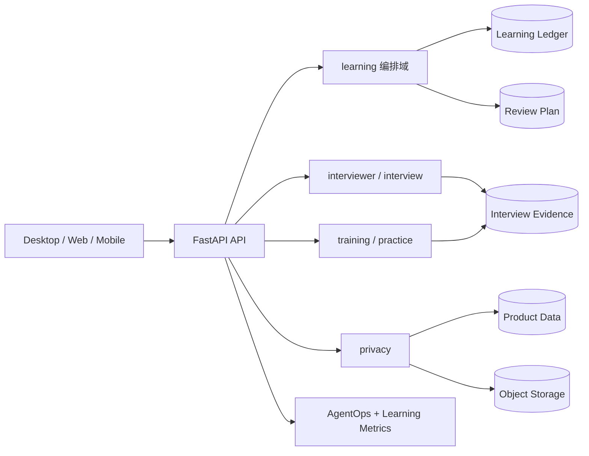

# Learning Harness 模块架构

## 1. 当前结论

项目采用模块化单体。身份、面试、训练、学习编排、隐私、计费和运维共享同一数据库事务边界，但通过目录、服务和路由分离。当前阶段不拆微服务；只有在独立扩缩容、故障隔离或团队所有权成为真实约束后再拆部署单元。



## 2. 后端所有权

| 模块 | 职责 | 不负责 |
| --- | --- | --- |
| `learning/` | Goal、Today 聚合、任务命令、验证、receipt、计划修订、同步、实时指标 | 生成面试答案、题目判分 UI、账户删除 |
| `interviewer/` | 面试官题纲、版本、人工证据及所有权校验 | 修改学习任务状态 |
| `training/` | 专项训练、间隔复习和训练完成事实 | 计划排序和跨域修订 |
| `privacy/` | 用户导出、删除申请、冷静期、执行 worker | 账务流水和安全审计物理删除 |
| `services/` | 旧业务应用服务、计费、AgentOps、报告和工作流 | 新增跨域学习状态机 |
| `infrastructure/` | DB、鉴权、对象存储、支付、遥测脱敏 | 产品状态决策 |
| `interfaces/routes/` | catalog、operations、review plan/progress/material/practice、study dashboard HTTP 适配 | Agent 会话状态和领域实现 |
| `interfaces/api.py` | 应用装配、兼容路由、身份/支付/简历/会话流 | 长期承载新增学习、训练或复习路由 |

依赖方向：HTTP 路由调用领域服务；`learning` 读取面试/训练产生的证据；面试和训练域不得反向写学习状态。`EffectReceipt` 是命令事实，前端布尔值不是完成依据。

## 3. 前端所有权

```text
apps/desktop/src/renderer/
  components/                 # 旧页面与薄装配层
  app/                        # 页面路由和 screen model 装配
  api/                        # 按 review/learning/interview/privacy 拆分的客户端
  hooks/                      # 账户、会话、Shell 导航和响应式控制器
  features/
    today/                    # Today 离线缓存和任务交互
    privacy/                  # 导出、删除和冷静期 UI
    operations/               # Learning 可靠性面板
    review-site/              # Today/题库/素材视图和远端数据控制
```

新增能力优先进入 `features/<domain>`；`App.jsx` 只做路由、跨域装配和少量页面级协调。会话生命周期由 `useInterviewSessionController` 管理，账户由 `useAccountController` 管理；复习站远端数据由 `useReviewSiteData` 管理。移动端复用 `packages/shared-types` 和 `packages/api-client` 的契约，不复用 React UI。

侧栏状态由 `hooks/useSidebarNavigation.js` 统一管理：桌面偏好持久化，紧凑视口默认关闭，支持快捷键和 Esc；移动端遮罩由独立 `SidebarBackdrop` 组件负责，导航完成后自动收起。Shell 只组合状态与组件，不承载领域业务。

## 4. 数据与一致性

- 命令使用 `expected_version` 做乐观锁，`Idempotency-Key` 防止重放副作用。
- `learning_effect_receipts` 只追加，是同步事件源和审计事实。
- Today 客户端离线只读；恢复联网后从 opaque cursor 拉取增量，再刷新服务端权威 Today。旧复习站页面的临时本地状态不宣称可同步。
- 不使用 CRDT。任务完成、验证和计划修订需要服务端领域规则，不适合客户端合并。
- 删除按显式 FK 顺序执行，并同步删除简历对象；账务、安全和删除审计保留最小必要记录。

## 5. 演进门槛

满足以下任一条件才评估拆服务：学习命令需要独立扩缩容；删除 worker 需要独立安全域；训练或面试拥有独立团队和发布节奏；单体故障域已成为可测量的 SLO 瓶颈。拆分前先完成 outbox、服务身份、跨服务幂等和数据所有权 ADR。

当前不做：为追求目录整齐大规模搬迁旧代码、引入第二套工作流引擎、把 PostgreSQL 事务拆成分布式事务。
