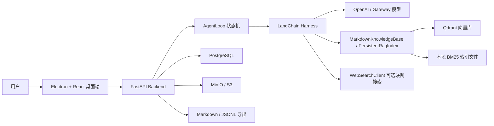

# Interview Agent 上线梳理

本文档用于把当前项目从“本地生产学习项目”梳理到“可以上线给用户试用”的状态。

当前结论：

- 适合：内部试用、邀请制小规模用户试用、单机单实例部署、生产化学习项目。
- 暂不适合：公开大规模用户、强隐私合规场景、多租户商业化直接放量。
- 当前已补齐最小安全基线：账号注册登录、API Token/管理员 Token、用户级数据隔离、支付回调幂等、用量扣费幂等、删除接口、会话恢复、上传和消息大小限制、基础频率限制。

## 1. 产品定位

Interview Agent 是一个面向 AI / 互联网技术岗位的面试训练产品。

当前支持两种模式：

| 模式 | 用户角色 | Agent 角色 | 典型场景 |
| --- | --- | --- | --- |
| Agent 面试我 | 候选人 | 面试官 | 用户上传简历，Agent 基于简历和 AI 知识库追问 |
| Agent 回答我 | 面试官 / 学习者 | 候选人 | 用户输入面试题，Agent 以当前简历候选人身份作答 |

当前行业只开放：

- 互联网行业

默认语言：

- 中文

核心卖点：

- 简历驱动，不只是泛泛八股题。
- AgentLoop 会根据回答质量自动决定继续深挖、切换方向或结束评价。
- RAG 自动注入 AI 相关知识库。
- 支持历史简历库、历史对话记忆和生产式数据存储。

## 2. 当前系统架构



## 3. 代码结构

```text
apps/desktop
  Electron 主进程、preload、React UI

backend/src/interview_agent/core
  AgentLoop、Harness、Guardrails、状态模型、面试配置

backend/src/interview_agent/interfaces
  FastAPI API、Typer CLI、终端命令解析

backend/src/interview_agent/services
  应用服务层：简历保存、面试持久化

backend/src/interview_agent/repositories
  Repository 层：PostgreSQL 读写

backend/src/interview_agent/infrastructure
  DB、对象存储、配置、简历解析、Codex 配置、联网搜索、doctor 检查

backend/src/interview_agent/rag
  Markdown 知识库、BM25/Hybrid 索引、Qdrant/JSON 向量库、RAG 评测

backend/src/interview_agent/embeddings
  本地 EmbeddingService、local/openai/service embedding client

knowledge_base
  AI 面试知识库、RAG/Agent/LLMOps/安全/系统设计资料

docs
  架构和上线文档
```

## 4. 核心业务链路

### 4.1 简历上传

```text
用户选择 PDF / Markdown
  -> Electron 读取文件并 base64
  -> POST /resumes
  -> ResumeService
  -> resume_parser 解析文本和摘要
  -> MinIO 保存原始文件
  -> PostgreSQL resumes 按 content_hash 去重 upsert
  -> 返回简历记录给桌面端
```

当前能力：

- 支持 PDF / Markdown。
- 支持多份简历。
- 相同文件按 sha256 去重。
- 桌面端可选择当前使用的简历。

上线注意：

- 需要限制文件大小。
- 需要明确隐私政策和数据删除能力。
- 需要病毒扫描或至少 MIME / 扩展名校验。

### 4.2 新建面试

```text
POST /sessions
  -> 读取当前模式、行业、简历内容、目标岗位
  -> 加载 Codex/OpenAI 模型配置
  -> 加载 RAG 索引和 Qdrant
  -> 创建 LangChainInterviewHarness 或 ScriptedInterviewHarness
  -> AgentLoop.start()
  -> PostgreSQL interview_sessions / interview_turns
  -> 返回第一题
```

当前能力：

- 面试官模式：基于简历提出第一题。
- 候选人模式：提示用户直接提问，Agent 作为候选人回答。
- 支持离线 harness 降级。

上线注意：

- 当前 API 的运行中会话存在进程内 `sessions` 字典里，服务重启后无法继续旧会话。
- 多实例部署时同一 session 必须固定到同一进程，或者把 AgentLoop 状态恢复能力做完整。

### 4.3 每轮问答

```text
POST /sessions/{id}/messages
  -> AgentLoop.step()
  -> Guardrails 检查用户输入
  -> 判断：正式回答 / 澄清问题 / 太短
  -> RAG 检索上下文
  -> LangChain 调模型
  -> Guardrails 检查模型输出
  -> PostgreSQL 保存 turn
  -> memory_decision 筛选高价值回答
  -> PostgreSQL memory_items
  -> Markdown / JSONL 导出
```

当前能力：

- 回答太短时不推进面试。
- 用户问“什么是 RAG”这类澄清问题时，不计入正式回答。
- 自动根据回答质量决定深挖或切换方向。
- 有效历史回答会沉淀为 memory。

上线注意：

- 需要加请求超时。
- 需要加并发控制。
- 需要加模型调用成本统计。
- 需要把失败原因结构化记录到日志/trace。

## 5. 数据架构

当前生产式存储拆分：

| 数据 | 当前位置 | 说明 |
| --- | --- | --- |
| 简历解析结果 | PostgreSQL `resumes` | 主业务数据 |
| 简历原文件 | MinIO/S3 | 对象存储 |
| 面试会话 | PostgreSQL `interview_sessions` | 配置和状态快照 |
| 面试轮次 | PostgreSQL `interview_turns` | 每轮问题/回答 |
| 历史记忆 | PostgreSQL `memory_items` | 筛选后的高价值内容 |
| 用户账户 | PostgreSQL `user_accounts` | 登录、试用次数、积分余额 |
| 积分流水 | PostgreSQL `credit_ledger` | 充值和消耗审计 |
| 充值订单 | PostgreSQL `recharge_orders` | 支付回调幂等 |
| 模型用量 | PostgreSQL `usage_records` | token、模型、扣费、幂等键 |
| 静态知识库索引 | `.interview_agent/rag_index.json` | 当前仍是本地文件 |
| 向量 | Qdrant / JSON vector file | 推荐 Qdrant |
| 可读导出 | `.interview_agent/conversations` / `.interview_agent/memory` | 调试和人工查看 |

已经有但尚未完全接入的表：

- `knowledge_documents`
- `rag_chunks`

它们为后续把知识库索引元数据纳入 PostgreSQL 做了准备。

## 6. RAG 现状

当前 RAG 来源：

- `knowledge_base/ai-interview-guide/docs`
- `knowledge_base/github-ai-knowledge`
- `.interview_agent/memory`

当前检索策略：

```text
离线构建：
Markdown -> chunk -> BM25 index -> optional embedding -> Qdrant / JSON vector store

在线检索：
query -> query expansion -> BM25 recall
      -> optional vector recall
      -> hybrid score
      -> MMR 去重
      -> Top-K context -> prompt
```

优点：

- 有 BM25 fallback。
- 支持本地 EmbeddingService。
- 支持 Qdrant。
- 有 RAG 回归评测。

上线前建议：

- 将知识库索引构建做成后台任务，不要手工跑命令。
- 为知识库来源增加 license / source 记录。
- memory 入库后应异步向量化到 Qdrant，而不是只靠重新构建本地索引。
- 增加检索命中日志，记录 query、chunk、score、最终是否被模型引用。

## 7. API 能力

当前 API：

| 方法 | 路径 | 作用 |
| --- | --- | --- |
| GET | `/health` | 健康检查 |
| POST | `/auth/register` | 邮箱注册 |
| POST | `/auth/login` | 邮箱密码登录 |
| POST | `/auth/dev-login` | 本地开发登录 |
| GET | `/me` | 当前登录用户和权益 |
| GET | `/account` | 账户积分余额 |
| POST | `/account/recharge` | 开发/管理员人工入账 |
| POST | `/payments/orders` | 创建待支付订单 |
| POST | `/payments/webhook` | 已签名支付回调入账 |
| POST | `/resume/parse` | 只解析简历，不保存 |
| POST | `/resumes` | 上传并保存简历 |
| GET | `/resumes` | 简历列表 |
| GET | `/resumes/{resume_id}` | 简历详情 |
| GET | `/sessions` | 历史会话列表 |
| GET | `/sessions/{session_id}` | 历史会话详情 |
| POST | `/sessions` | 创建面试会话 |
| POST | `/sessions/{session_id}/messages` | 发送用户消息 |
| GET | `/sessions/{session_id}/transcript` | 查看当前进程内 transcript |

上线前仍需补齐：

- 正式短信验证码、微信/Apple/OAuth 登录校验和账号绑定。
- 支付平台的创建订单接口、金额对账、退款/撤销流水。
- 更完整的用户/租户管理、封禁、注销和数据导出。
- 统一错误码。
- 结构化 API 访问日志、审计日志、trace_id。
- 管理后台和客服操作审批。

## 7.1 生产安全开关

`INTERVIEW_ENV=production` 时应用会启动前自检，以下配置不满足会直接拒绝启动：

- `INTERVIEW_API_AUTH_REQUIRED=true`
- `INTERVIEW_AUTH_TOKEN_SECRET` 至少 32 字符且不能使用默认值
- `INTERVIEW_AUTH_DEV_LOGIN_ENABLED=false`
- `INTERVIEW_AUTH_MOCK_PROVIDER_LOGIN_ENABLED=false`
- `INTERVIEW_ALLOW_MOCK_RECHARGE=false`
- `INTERVIEW_PAYMENT_WEBHOOK_SECRET` 至少 24 字符
- `INTERVIEW_OBJECT_STORAGE_BACKEND` 不能是 `local`
- `DATABASE_URL` 不能是 SQLite
- `INTERVIEW_ALLOWED_ORIGINS` 不能是 `*`

数据权限边界：

- 简历、会话和历史 memory 均使用 `tenant_id + user_id` 查询。
- 同租户不同用户不能读取彼此简历、会话或 memory。
- `resume_id` 创建会话前会校验归属，不能引用他人的简历。
- 用户充值不能直改余额；生产只接受签名支付回调，管理员人工入账需要管理员 token。

## 8. 桌面端现状

当前桌面端：

- Electron 主进程负责调用本地 API。
- React 渲染对话 UI。
- 支持上传简历、选择历史简历。
- 支持面试官/候选人模式。
- 支持联网搜索开关。
- API 不可用时有 retry 和错误提示。

上线前建议：

- 明确产品形态：桌面端本地应用，还是 Web SaaS。
- 如果给普通用户使用，Electron 应打包签名。
- 如果后端部署在云端，桌面端不能默认连 `127.0.0.1:8020`，需要配置远端 API。
- 简历上传前应展示隐私提示。
- 增加会话历史列表。

## 9. 配置和启动

关键配置见 `.env.example`：

```text
OPENAI_API_KEY / GATEWAY_API_KEY
OPENAI_MODEL
DATABASE_URL
QDRANT_URL
QDRANT_COLLECTION
OBJECT_STORAGE_ENDPOINT
OBJECT_STORAGE_ACCESS_KEY
OBJECT_STORAGE_SECRET_KEY
OBJECT_STORAGE_BUCKET
EMBEDDING_SERVICE_URL
```

本地生产栈：

```bash
make install
make up
make migrate
./interview embedding-service
./interview index --embeddings --embedding-provider service --vector-store qdrant
make api
npm --prefix apps/desktop run desktop
```

当前 Docker 注意点：

- `make up` 会优先使用 Docker Compose。
- 如果本机没有 Docker Compose，会回退到 `docker run`。
- MinIO 映射到 `9002/9003`，避免本机 `9000/9001` 冲突。

## 10. 当前验证基线

最近一次验证结果：

```text
make test                                      48 passed
npm --prefix apps/desktop run build           passed
cd backend && DATABASE_URL=sqlite+aiosqlite:///:memory: ../.venv/bin/alembic heads
                                               20260704_0001 (head)
node --check apps/desktop/src/main.js          passed
node --check apps/desktop/src/preload.js       passed
```

已覆盖测试：

- AgentLoop 状态推进。
- Harness 护栏。
- API session request 处理。
- 简历解析和简历存储。
- 生产式存储服务。
- Conversation memory 过滤。
- RAG index / eval。
- EmbeddingService。
- WebSearchClient。
- Doctor 检查。

测试缺口：

- 真实 PostgreSQL 集成测试。
- 真实 MinIO 集成测试。
- 真实 Qdrant 集成测试。
- Electron e2e UI 测试。
- 模型调用集成测试。
- 并发会话测试。
- 文件大小和恶意文件测试。

## 11. 上线风险分级

### P0：上线前必须处理

1. 正式用户体系

当前已经支持 API Token 到 tenant 的映射，适合内部试用和邀请制测试。
公开上线前仍需要正式登录、用户表、租户管理、token 轮换和权限模型。

2. 会话状态恢复和多实例问题

当前已支持从 PostgreSQL `state_json` 恢复 AgentLoop 状态。
多实例部署仍建议接入共享缓存、会话粘滞或完全无状态恢复策略，并增加并发一致性保护。

3. 隐私和数据删除

简历属于高敏感数据。
当前已提供删除简历和删除会话 API；后续还应补充用户自助数据导出、删除审计和对象存储删除失败补偿。

4. 请求限制和文件限制

当前已支持上传大小、消息长度和基础固定窗口频率限制。
后续需要更细粒度的用户级、模型调用级、IP 级和成本级限流。

5. 生产密钥管理

不能依赖本地 Codex 配置或 `.env` 裸放密钥。
生产应使用环境变量、KMS 或平台 Secret。

### P1：上线小规模试用前强烈建议处理

1. API 统一错误码和结构化日志。
2. LLM 调用超时、重试、限流和成本统计。
3. RAG 检索日志和质量监控。
4. 后台任务化：索引构建、memory embedding、知识库更新。
5. 会话历史 UI。
6. Electron 打包签名或明确 Web 化路线。
7. Docker 镜像构建和部署脚本。

### P2：正式商业化前处理

1. 多行业配置。
2. 管理后台。
3. 账单和配额。
4. 数据导出。
5. 灰度发布。
6. SLA 监控。
7. OpenTelemetry tracing。
8. 安全审计和合规文档。

## 12. 推荐上线路线

### 阶段 1：内部 alpha

目标：你自己和少量可信用户试用。

允许条件：

- 单机单实例。
- 手动创建 `.env`。
- 手动跑 `make up` / `make migrate` / `make api`。
- 用户知道这是试用版。

必须补：

- 配置 API Token。
- 配置上传和消息大小限制。
- 明确试用用户的数据删除说明。

### 阶段 2：邀请制 beta

目标：10-50 人使用。

必须补：

- 用户登录。
- 多用户隔离。
- 会话状态从 DB 恢复。
- Docker 镜像和部署文档。
- PostgreSQL / MinIO / Qdrant 数据备份。
- 结构化日志。
- 模型调用成本统计。

### 阶段 3：公开上线

目标：普通用户可注册使用。

必须补：

- Web 端或正式签名桌面端。
- 支付/配额/限流。
- 数据删除和隐私协议。
- 监控告警。
- 管理后台。
- 安全扫描和依赖漏洞治理。
- 灰度发布和回滚。

## 13. 下一步实施清单

建议按这个顺序推进：

1. 增加 `users` 表和 API token 鉴权。
2. 把所有主表从 `tenant_id=default` 改为真实 `user_id / tenant_id`。
3. 增加简历删除、会话列表、会话详情、会话删除 API。
4. 实现 AgentLoop 从 `interview_sessions.state_json` 恢复。
5. 给上传接口加文件大小限制和类型校验。
6. 增加 Dockerfile 和生产启动命令。
7. 加入结构化日志和 request id。
8. 把 memory embedding 做成后台任务并写入 Qdrant。
9. 增加 Playwright / Electron e2e 测试。
10. 做一次真实 Postgres + MinIO + Qdrant 集成测试。

## 14. 当前能否上线

如果你的“上线”是给自己或少量可信用户试用：

- 可以，但建议先补最小鉴权和删除能力。

如果你的“上线”是公开给不认识的用户使用：

- 现在还不建议。
- 主要阻塞是用户隔离、隐私删除、会话恢复、请求限制和生产部署链路。

这个项目现在已经有了比较扎实的生产架构骨架，下一步重点不再是“数据库换什么”，而是把用户体系、运行态恢复、隐私合规和可观测性补上。
